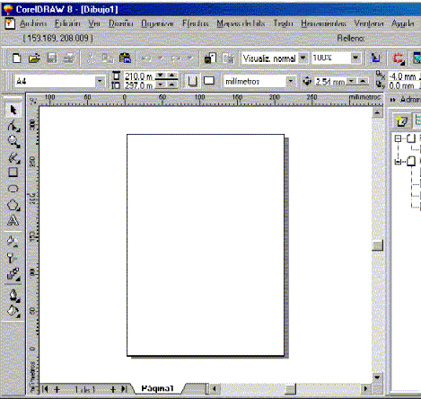

# HELP de PERFILES

Traducción del help de los programas de construcción de perfiles en Corel Draw 8 (20230724)

Los programas de construcción de perfiles son dos

- perfil_rocas2

  Genera perfiles comunes

- perfil_rocasymuestras

  Genera perfiles y ubica las muestras

## Procedimientos

Para comenzar hay que arrancar el Corel-Draw, y luego abrir un documento en blanco o nuevo presionando sobre el icono tal cual se indica en el dibujo.

Asi es como debe quedar el Corel-Draw

Hay que ir al icono de ABRIR APLICACIONES, y luego precionando suavemente 
se despliega el menu con la lista de aplicaciones.

Luego deslizando el cursor se selecciona el programa SCRIPT EDITOR

Lo que sucede despues es el despliegue de la ventana del SCRIPT EDITOR. 

A continucación hay que abrir los programas para COREL SCRIPT, presionando sobre el icono ABRIR.

Aparece el menu y hay que seleccionar el programa perfil_rocas2 o perfil_rocasymuestras.

Luego cuando se despliega el listado del programa, hay que buscar las lineas
 que aparecen en el grafico y escribir el nombre del archivo de datos del perfil.
 
Luego para que el programa arranque se presiona la tecla **F5**.

## Formato de Archivo CSV

Los items corresponden a:

Número de orden, espesor, tipo litológico, color, inicio de la capa, final de la capa, nombre formacional

El **tipo litologico** corresponde al nombre de un archivo de patrones en formato bmp localizado en el subdirectorio **pats**.

1|5|caliza\_w|blanco|0|5|tabanos
:-----:|:-----:|:-----:|:-----:|:-----:|:-----:|:-----:
2|2.5|caliza\_w|blanco|5|7.5|tabanos
3|7.5|caliza\_p|blanco|7.5|15|tabanos
4|10|caliza\_g|blanco|15|25|tabanos
5|0|cubierto|blanco|25|25|pp

## Ejemplo de Perfil Generado con este Script

